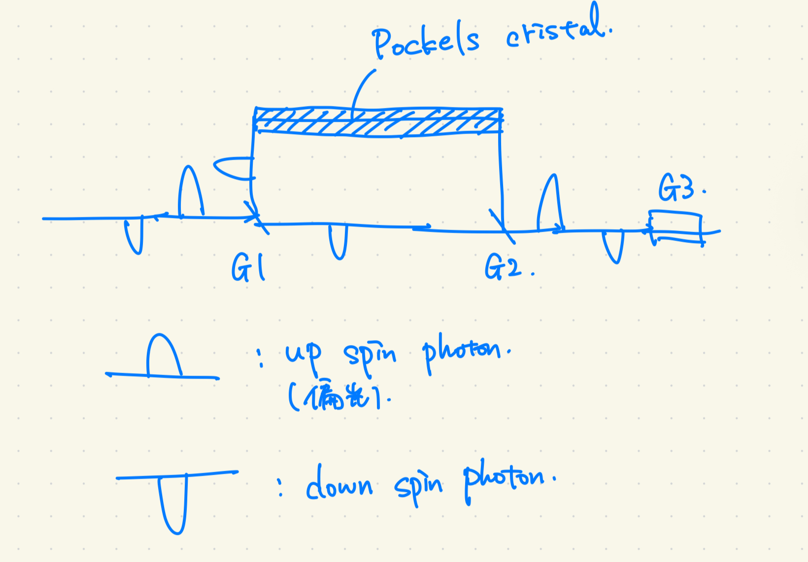
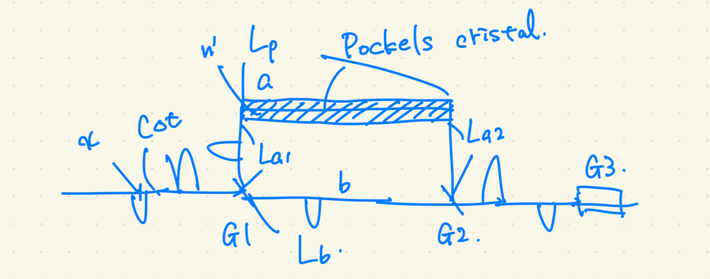
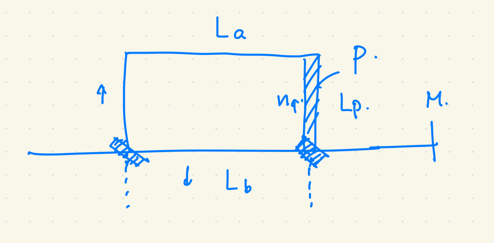

# 光Kerr効果

光Kerr効果は、光の強度、すなわち電場の2乗に依存して屈折率が変化する効果である[@hattori][^7]。
$$\begin{align}
n = n_0 + n_2 I
\end{align}$$
ここで、$I$は光の強度であり、$n_0$は線形屈折率(光が弱いときに観測される屈折率)、$n_2$は非線形屈折率である。

よって、光子を多数入射することで、光子数に応じた屈折率の変化をさせることができる。

長さ$L$のKerr媒質中の光子光子相互作用のハミルトニアンを生成消滅演算子で[^8]で書くと、
$$\begin{align}
\hat{H}_\text{Kerr} = \hbar \kappa a^\dagger a^\dagger a a= \hbar \kappa a^\dagger(a a^\dagger-1)a = \hbar \kappa (\hat{n}^2 - \hat{n})
\end{align}$$ である[@imamoglu1997strongly]。
ここで、$\kappa$はKerr非線形係数である。

Hamiltonianを見ると、この効果は光子数が2つ以上のときに現れることがわかる。

Kerr効果にはcross-Kerr効果とself-Kerr効果がある[@koshinoPhysRevA.75.063807]。
cross-Kerr効果は異なるモード間の相互作用を表し、self-Kerr効果は同じモード内の相互作用を表す。
今は波束を考えるため、cross-Kerr効果を考えるとよいはずである。
2光子での相互作用が必要なので、時間差で打ち出す時は、2光子が同時にKerr媒質内に存在する(Kerr媒質内で2光子の波動関数の重なりが存在する)ように時間差を調整する必要がある。
この設定は今のセットアップでは想定していないため、一旦保留する。

時間発展演算子は $$\begin{align}
U_\text{Kerr}(t) = \exp\left(i\kappa \int_{0}^{T} (\hat{n}^2 - \hat{n}) dt \right) = \exp\left(i\kappa \int_{0}^{L} (\hat{n}^2 - \hat{n}) \frac{dz}{v}\right)
\end{align}$$ となる。
2つ目の等号では、媒質中の光の速度を$v$として変数変換を行った。

これを見ると、第2項がbosonizationに必要な位相を与え、$\hat{n}^2$の項が追加で現れることがわかる[^9]。

.5ex plus .2ex minus .2ex(10/16追記)Kerr効果によるanyonization(途中)

::: itembox
**Prop.Kerr効果によるanyonization(証明未完)**
Kerr効果で駆動される系を考える。 時間発展演算子は $$\begin{align}
U_\text{Kerr}(t) = \exp\left(i\kappa \int_{0}^{L} (\hat{n}^2 - \hat{n}) \frac{dz}{v}\right)
\end{align}$$ である。
この時、Kerr効果を受ける媒質内ではbosonがanyon化する。
つまり、時刻$t=0$にKerr媒質に入ったboson場の演算子$\Phi(0)$は時刻$t=T$でanyonの場の演算子$\Phi_a(x)=\Phi(x=vT)$になり、anyonの交換関係
$$\begin{align}
\Phi_a(x)\Phi_a(y)=e^{i\theta \text{sgn}(x-y)}\Phi_a(y)\Phi_a(x)
\end{align}$$ を満たす(かもしれない)。
:::

::: proof
*Proof.* 時刻$t$でのboson場の消滅演算子$\Phi(t)$を計算する。
$$\begin{align}
    \Phi(t) &= U_\text{Kerr}^\dagger(x) \Phi(0) U_\text{Kerr}(x)\\
    &= \exp\left(-i\kappa \int_{0}^{x} (\hat{n}^2 - \hat{n}) \frac{dz}{v}\right) \Phi(0) \exp\left(i\kappa \int_{0}^{x} (\hat{n}^2 - \hat{n}) \frac{dz}{v}\right)\\
    &= \exp\left(-i\frac{\kappa}{v} (\hat{N}^2(x) - \hat{N}(x)) \right) \Phi(0) \exp\left(i\frac{\kappa}{v} (\hat{N}^2(x) - \hat{N}(x)) \right)
\end{align}$$
この状態と、別の引数を持つboson演算子$\Phi(y)$を持ってきて、交換関係を考える。
(途中) ◻
:::

この計算を調べていると、このセットアップで、ミクロな相互作用としてデルタ関数型で入れると、Lieb-Liniger模型という模型になり、これはeffectiveにanyonを出すことがわかった。
相互作用を変えてgeneralized
Lieb-Liniger模型にしている論文もいくつか見つけられた。
(10/16追記終わり)\
.5ex plus .2ex minus .2exPockels効果によるanyonization
マルチモードで議論している文献が見つからない。
とりあえず単一モードで議論する。
自由粒子のHamiltonianと相互作用Hamiltonianに分け、相互作用表示でボソン場の演算子の時間発展を考える。
電場$E$を印加した時のPockels結晶内のHamiltonianは $$\begin{align}
\hat{H}_\text{Pockels} \coloneqq H_0 + H_{\text{int}}= \omega \hat{a}^\dagger \hat{a} + \frac{1}{2} \epsilon E^2 + \alpha \hat{a}^\dagger \hat{a} E
\end{align}$$ である。
相互作用表示の状態ベクトル$\ket{\psi_I(t)}$は、Heisenberg表示の状態ベクトル$\ket{\psi_H}$を用いて
$$\begin{align}
\ket{\psi_I(t)} = T\exp\left(-i\int \hat{H}_{\text{int}}(t) dt /\hbar \right)\ket{\psi_H}
\end{align}$$
とかけ、Heisenberg表示の演算子$\hat{F}(t)$と相互作用表示の演算子$\hat{F}_I(t)$は
$$\begin{align}
\hat{F}_I(t) = \exp\left(i\hat{H}_0 t/\hbar \right)\exp\left(-i\int \hat{H}_{\text{int}} dt /\hbar \right)\hat{F}(t)\exp\left(i\int \hat{H}_{\text{int}} dt /\hbar \right)\exp\left(-i\hat{H}_0 t/\hbar \right)
\end{align}$$ となる。
ボソン場の消滅演算子$\Phi_I(t)=\int d^3k (e^{i(kx-\omega t)}a_k + e^{-i(kx-\omega t)}a_k^\dagger)$は、相互作用表示にすると、
$$\begin{align}
\Phi_H &= \exp\left(i(\hbar \omega\hat{n}+\epsilon E^2) t/\hbar \right)\exp\left(-i\int \alpha \hat{n}E dt /\hbar \right)\Phi(t)\exp\left(i\int \alpha \hat{n}E dt /\hbar \right)\exp\left(-i(\hbar \omega\hat{n}+\epsilon E^2) t/\hbar \right)
\end{align}$$ あとはBCH公式を用いるとよい。

.5ex plus .2ex minus .2ex11/2追記

モデルの概念図を以下に示す。

<figure data-latex-placement="htbp">

<figcaption>Pockels効果を用いたanyonizationの概念図</figcaption>
</figure>

パスは全て光ファイバーで、その中を光子が通る。
G1,G2,G3は量子ゲートである。
G1は偏光の向き(スピンの向き)によりパスを分ける役割を持っており、偏向板などで実現できる。
G2は二つの光子を一つのパスに合流させる役割を持っており、ビームスプリッターで実現できる。
G3は二つの光子の位相(到達時間)を測定する。

時空平面でのブレイディング図を以下に示す。

<figure data-latex-placement="htbp">

<figcaption>Pockels効果を用いたanyonizationのブレイディング図</figcaption>
</figure>

使う文字を示した図を以下に示す。

<figure data-latex-placement="htbp">

<figcaption>Pockels効果を用いたanyonizationの記号説明</figcaption>
</figure>

初めに光子を入れる時間間隔を$\Delta t$とする。
初期状態は$\ket{\psi_{\text{in}}}=\ket{\uparrow(x+ct)\otimes \ket{\downarrow(x)}}$である。
以下、テンソル積の記号$\otimes$は省略する。

G1,G2の効果は省略する。 二つのパスに分かれ、合流した後の状態は
$$\begin{align}
\ket{\psi_{\text{out}}} &= U\ket{\psi_{\text{in}}} = U_{L_{a2}}U_p U_{L_{a1}}\ket{\uparrow(x+c\Delta t)}U_{{L_b}} \ket{\downarrow(x)}\\
&= e^{-i n_0 k_0 (L_{a2}+L_{a1})} e^{-i\int_{\tau_1}^{\tau_2} \alpha E(t) \hat{n} dt} \ket{\uparrow(x+c\Delta t)} e^{-in_0 k_0 L_b} \ket{\downarrow(x)}\\
&= e^{-i n_0 k_0 (L_{a2}+L_{a1})} e^{-i \int_{x_1}^{x_2} \alpha E(x/v) \hat{n} \frac{dx}{v}} \ket{\uparrow(x+c\Delta t)} e^{-in_0 k_0 L_b} \ket{\downarrow(x)}\\
&= e^{-i\int_{x_1}^{x_2} \frac{\alpha E(x/v)}{v} \hat{n} dx} \ket{\uparrow(x+c\Delta t- n_0 (L_{a2}+L_{a1}))} \ket{\downarrow(x - n_0 L_b)}
\end{align}$$ となる。全て状態ケットの中に入れると、 $$\begin{align}
\ket{\psi_{\text{out}}} &= \ket{\uparrow(x+c\Delta t- n_0 (L_{a2}+L_{a1}) +\int_{x_1}^{x_2} \frac{\alpha E(x/v)}{k_0 v} \hat{n} dx)} \ket{\downarrow(x - n_0 L_b)}
\end{align}$$ となる。 最後の結果からは、 $$\begin{align}
-c \Delta t + n_0 (L_{a2}+L_{a1} - L_b) + \int_{x_1}^{x_2} \frac{\alpha E(x/v)}{k_0 v} \hat{n} dx >0
\end{align}$$ の時、粒子が入れ替わることがわかる。

波動関数の位置表示を考えると、 $$\begin{align}
\braket{r}{\uparrow(x-c\Delta t)\downarrow(x)} &= \psi (r - (x-c\Delta t,x))\\
\end{align}$$ である。 $$\begin{align}
n_0 (L_{a2}+L_{a1})=X,\,\,\, n_0 L_b = Y
\end{align}$$ とおくと、終状態の波動関数は $$\begin{align}
e^{-i\int_{x_1}^{x_2} \frac{\alpha E(x/v)}{v} \hat{n} dx} \braket{r}{\uparrow(x+c\Delta t - X)\downarrow(x - Y)} &= \psi \left( x+c\Delta t - X , x - Y \right)\\
\end{align}$$ である。
(時間間隔を一般にするという意味で)一般化させると、 $$\begin{align}
\psi(x,y) = e^{\int_{l\in l_p} \alpha E(l/v) \hat{n} \frac{dl}{v}} \braket{r}{\uparrow(x-X)\downarrow(y-Y)}
\end{align}$$ になると思われる。
ここで、$l_p$はPockels結晶の長さである。\

- 変数をシフトして、エニオンの定義式$\psi(x,y)=e^{i\theta}\psi(y,x)$までいけるか?

- $\hat{n}=1$なのではないか?$\to$今はそうだが、多粒子化を見込んでこのような定義を用いている。あるいは、電場を量子的に扱うとその限りではなくなるかもしれない。

- Jordan-Wigner変換は、積分の上端が$x$、下端が$-\infty$である。これに対応させるには?$\to$現在の処方はJ-W変換ではないため、対応させる必要性がない。位相がつけば十分である。

- anyonの場の交換関係$\Phi^\dag(x)\Phi^\dag(y)=\Phi^\dag(y)\Phi^\dag(x)e^{i\theta \text{sgn}(x-y)}$を見ると、位相に$\text{sgn}(x-y)$が現れる。これをどうやって出すか?$\to$Pockels効果の結合定数の対称性から出す。(このような定数が取れるかは謎である。)

.5ex plus .2ex minus .2exモデル改善
パス$a$はわざわざ2通りに分ける必要はないと気づいた。
あと、J-W変換に乗っけるためにはPockels効果を伸ばすべきだと考えた(積分の上端を$x$にしたい。)。
改善したモデルの図を以下に示す。\
\
\
\
\

<figure data-latex-placement="htbp">

<figcaption>Pockels効果を用いたanyonizationの改善モデルの概念図(なんでこれ右に寄っちゃうんだ？)</figcaption>
</figure>

懸念点は以下である。

- 場の交換関係に$\text{sgn}(x-y)$が現れない。これは、今のセットアップでは、ブレイディングするという前提で進めているため、順序が決まっているからであろうと考えられる。

- スピンのアップダウンが異なる粒子のブレイディングを考えているが、これは同種粒子として扱ってよいか？

$$f(x) = \underbrace{\frac{1}{(\pi \sigma^2)^{1/4}}}_{\text{規格化定数}} \exp\left[ \underbrace{-\frac{(x - x_0)^2}{2\sigma^2}}_{\text{包絡線 (ガウス分布)}} + \underbrace{i k_0 x}_{\text{搬送波 (運動量)}} \right]$$

.5ex plus .2ex minus .2exモデル改善 11/20追記 .5ex plus .2ex minus
.2exシステム設定と物理的描像 粒子の定義:

スピンUp ($\hat{\psi}_\uparrow$):
ポッケルス効果を受ける光子。先にパスに入射する。

スピンDown ($\hat{\psi}_\downarrow$):
ポッケルス効果を受けない光子。$\Delta t$ の時間差を持って入射する。\
パス構成:

Path $\uparrow$: 長さ $L_p$、屈折率 $n_p$（ポッケルス媒質）。

Path $\downarrow$: 長さ $L_f$、屈折率 $n_0$（自由導波路）。\
ブレイディング（交換）: パスを1次元空間と考える。
パスの長さや屈折率の差により、後から入った $\downarrow$ が、媒質中で
$\uparrow$ を追い抜く。 この「追い抜き」を粒子の交換とみなす。
追い抜いて位相を獲得するという状況は、1次元系におけるanyonの定義に対応する。\
結合定数のパリティについて:ポッケルス効果の結合定数 $g(k)$ が波数 $k$
に対して奇関数（$g(-k) = -g(k)$）であると仮定。
これは空間微分を考えると、時間反転対称性を破ることに対応する。

.5ex plus .2ex minus .2exハミルトニアンと時間発展
全ハミルトニアンを自由部分 $H_0$ と相互作用部分 $H_{int}$ に分ける。

まず、自由ハミルトニアン $H_0$について。

両方の光子はそれぞれのパスを群速度 $v_\uparrow, v_\downarrow$
で進むことにする。 分散関係は線形とする $$\begin{align}
\omega_{k\sigma} = v_\sigma |k|, \quad \sigma = \uparrow, \downarrow
\end{align}$$

自由なハミルトニアンはスピンに依存しないので以降略して、一つの光子のみを見ると、
$$\begin{align}
\hat{H} = \int_{-\infty}^{\infty} dk \, \hbar \omega_k \, \hat{a}_k^\dagger \hat{a}_k \approx \int_{-\infty}^{\infty} dk \, \hbar v |k| \, \hat{a}_k^\dagger \hat{a}_k
\end{align}$$ となる。 これを位置表示に変換する。

::: itembox
**Def. 場の演算子** 場の演算子を定義する。 $$\begin{align}
  \hat{\psi}(x) = \int_{-\infty}^{\infty} \frac{dk}{\sqrt{2\pi}} \hat{a}_k e^{ikx} \quad \Leftrightarrow \quad \hat{a}_k = \int_{-\infty}^{\infty} \frac{dx}{\sqrt{2\pi}} \hat{\psi}(x) e^{-ikx}
\end{align}$$
:::

これを用いて、変形する。 $$\begin{align}
\hat{H}_0 &= \int_{-\infty}^{\infty} dk \, \hbar v \, \hat{a}_k^\dagger (|k| \hat{a}_k)  = \int_{0}^{\infty} dk \, \hbar v \, \hat{a}_k^\dagger (k \hat{a}_k) + \int_{-\infty}^{0} dk \, \hbar v \, \hat{a}_k^\dagger (-k \hat{a}_k) \\
&= \int_{0}^{\infty} dk \, \hbar v \, \hat{a}_k^\dagger (k \hat{a}_k) + \int_{0}^{\infty} dk' \, \hbar v \, \hat{a}_{-k'}^\dagger (-(-k') \hat{a}_{-k'}) \quad (k'=-k)\\
&= \int_{0}^{\infty} dk \, \hbar v \, \hat{a}_k^\dagger (k \hat{a}_k) + \int_{0}^{\infty} dk \, \hbar v \, \hat{a}_{-k}^\dagger (k \hat{a}_{-k}) \\
&= \int_{0}^{\infty} dk \, \hbar v  \, (\hat{a}_k^\dagger (k \hat{a}_k) + \hat{a}_{-k}^\dagger (k \hat{a}_{-k}))
\end{align}$$

まず第1項は $$\begin{align}
\int_{0}^{\infty} dk \, \hat{a}_k^\dagger (k \hat{a}_k) &= \int_0^{\infty} dk \hat{a}^\dagger_k k \int_{-\infty}^{\infty} \frac{dx}{\sqrt{2\pi}} \hat{\psi}(x) e^{-ikx} \\
&= \int_{-\infty}^{\infty} dx \int_0^{\infty} dk \hat{a}^\dagger_k k \frac{1}{\sqrt{2\pi}} \hat{\psi}(x) e^{-ikx} \\
&= \int_{-\infty}^{\infty} dx \int_0^{\infty} dk \hat{a}^\dagger_k \left( \hat{\psi}(x) i \partial_x(e^{-ikx}) \right)\\
\end{align}$$ ここで、$x$についての部分積分を用いると、 $$\begin{align}
&= \left[ \left( \int_0^{\infty} \frac{dk}{\sqrt{2\pi}} i e^{ikx} \hat{a}^\dagger_k \right) \hat{\psi}(x) \right]_{x=-\infty}^{x=\infty} - \int_{-\infty}^{\infty} dx \left( \int_0^{\infty} \frac{dk}{\sqrt{2\pi}} e^{ikx} \hat{a}^\dagger_k \right) (i \partial_x \hat{\psi}(x)) \\
\end{align}$$ になる。 無限遠で場が0になることから、表面項は消える。
よって、 $$\begin{align}
&=-i \int_{0}^{\infty} dk \, \int_{-\infty}^{\infty} dx \, \int_{-\infty}^{\infty} dx' \psi^\dagger(x') \frac{e^{ik(x'-x)}}{2\pi} \partial_x \hat{\psi}(x) \\
&= -i \int_{-\infty}^{\infty} dx \,\int_{-\infty}^{\infty} dx' \hat{\psi}^\dagger(x') \partial_x \hat{\psi}(x)  \, \frac{1}{2}\delta(x'-x) \\
&= - \frac{i}{2} \int_{-\infty}^{\infty} dx \, \hat{\psi}^\dagger(x) \partial_x \hat{\psi}(x)
\end{align}$$ 第2項について、 $$\begin{align}
\int_{0}^{\infty} dk \,\hat{a}_{-k}^\dagger (k \hat{a}_{-k}) = \int_{0}^{\infty} d(-k) \, \hat{a}_{-k}^\dagger (-k \hat{a}_{-k}) = \int_{0}^{-\infty} dk \, \hat{a}_k^\dagger (k \hat{a}_k)
\end{align}$$ となる。 同様の計算を行うと、δ関数になるところが
$$\begin{align}
\int_{0}^{-\infty} \frac{dk}{2\pi} e^{ik(x'-x)} = \frac{1}{2}\delta(x'-x)
\end{align}$$ となるので、計算結果は第1項と等しくなる。
よって、全体では、 $$\begin{align}
\hat{H}_0 &= -i \hbar v\, \int_{-\infty}^{\infty} dx \, \hat{\psi}^\dagger(x) \partial_x \hat{\psi}(x)
\end{align}$$ となる。 スピン依存性を戻して2光子系に拡張すると、
$$\begin{align}
H_0 = \int dx \left[ \hat{\psi}_\uparrow^\dagger (-i\hbar v_\uparrow \partial_x) \hat{\psi}_\uparrow + \hat{\psi}_\downarrow^\dagger (-i\hbar v_\downarrow \partial_x) \hat{\psi}_\downarrow \right]
\end{align}$$ となる。

次に、相互作用ハミルトニアン $H_{int}$ について、 $$\begin{align}
\hat{H}_{int}(t) = \int dx \, \hbar g(k) \chi^{(2)} E_{ctrl}(x,t) \, \hat{\psi}^\dagger_\uparrow(x) \hat{\psi}_\uparrow(x)
\end{align}$$ となる。 ここで、$E_{ctrl}(x,t)$
は制御電場であり、ポッケルス効果を引き起こす。

.5ex plus .2ex minus .2ex時間発展 相互作用描像で考えたい。
まずこの描像をまとめる。
相互作用描像は、自由ハミルトニアン$H_0$の固有状態が相互作用ハミルトニアン$H_{int}$の作用によりほかの固有状態に遷移する様子を記述する。
状態ベクトルは相互作用ハミルトニアンで時間発展し、演算子は自由ハミルトニアンで時間発展する。

相互作用描像の状態ベクトルは、シュレーディンガー描像の状態ベクトルを用いて、
$$\begin{align}
\ket{\psi_I(t)} = \exp\left(\frac{i}{\hbar}\int H_0 dt \right)\ket{\psi_S}
\end{align}$$ と定義される。 このベクトルが満たす運動方程式は、
$$\begin{align}
i\hbar \frac{\partial}{\partial t} \ket{\psi_I(t)} = H_{int,I}(t) \ket{\psi_I(t)}
\end{align}$$ である。 この方程式を朝永-Schwinger方程式という。
右辺の$H_{int,I}(t)$は相互作用描像の相互作用ハミルトニアンであり、
$$\begin{align}
H_{int,I}(t) = T\exp\left(\frac{i}{\hbar}\int H_0 dt \right) H_{int}(t) \exp\left(-\frac{i}{\hbar}\int H_0 dt \right)
\end{align}$$ と定義される。
一般に、シュレーディンガー表示の任意の物理量$F$の相互作用描像での演算子$F_I(t)$は、
$$\begin{align}
F_I(t) = T\exp\left(\frac{i}{\hbar}\int H_0 dt \right) F_S(t) \exp\left(-\frac{i}{\hbar}\int H_0 dt \right)
\end{align}$$ と定義される。
この演算子が従う運動方程式は上式を微分することで、 $$\begin{align}
i\hbar \frac{\partial}{\partial t} \hat{\psi}_I(t) = [\hat{\psi}_I(t), H_0(t)]
\end{align}$$ となる。 Heisenberg表示との整合性を見る。
一般に、Heisenberg表示の任意の物理量$F$とSchroedinger表示の物理量$F_S$は、
$$\begin{align}
F_H(t) = \exp\left(\frac{i}{\hbar} H t \right) F_S(t) \exp\left(-\frac{i}{\hbar} H t \right)
\end{align}$$ と関係するので、これに(88)の逆変換を代入することで、
$$\begin{align}
F_H(t) = T\exp\left(\frac{i}{\hbar} H t \right) \exp\left(-\frac{i}{\hbar}\int H_0 dt \right) F_I(t) \exp\left(\frac{i}{\hbar}\int H_0 dt \right) \exp\left(-\frac{i}{\hbar} H t \right)
\end{align}$$ となる。 時間発展演算子を用いて書いてみる。
時刻$t'$と時刻$t(>t')$の間の相互作用表示の状態をつなぐ時間発展演算子$U(t,t')$を
$$\begin{align}
\ket{\psi_I(t)} = U(t,t') \ket{\psi_I(t')}
\end{align}$$ と定義する。 (85)式を用いることで、 $$\begin{align}
U(t',t) = T\exp\left(\frac{i}{\hbar}\int H_0 dt \right)\exp\left(-\frac{i}{\hbar}\int_{t'}^{t} H_{int,I}(t) dt \right)\exp\left(-\frac{i}{\hbar}\int H_0 dt \right)
\end{align}$$ となる。 一般に、$H$と$H_0$は交換しないことに注意する。
(92)式を朝永-Schwinger方程式に代入すると、時間発展演算子が満たす運動方程式は、
$$\begin{align}
i\hbar \frac{\partial}{\partial t} U(t,t') = H_{int,I}(t) U(t,t')
\end{align}$$ となる。
これらより、Heisenberg表示と相互作用表示を変換すると、状態ベクトルは
$$\begin{align}
\ket{\psi} = U(0,t) \ket{\psi_I(t)}
\end{align}$$ となり、演算子は $$\begin{align}
F_H(t) = U^\dag(t,0) F_I(t) U(t,0)
\end{align}$$ となる。 時間発展演算子は $$\begin{align}
U(t,0) = T\exp\left(-\frac{i}{\hbar}\int_{0}^{t} H_{int,I}(t) dt \right)
\end{align}$$ となるので、(96)式を解くときはBCH公式を用いることになる。\
場の演算子を、位置にのみ依存するシュレーディンガー表示の場の演算子$\hat{\psi}_S(x)$として、相互作用描像に移ると、
$$\begin{align}
\hat{\psi}_I(x,t) = T\exp\left(\frac{i}{\hbar}\int H_0 dt \right) \hat{\psi}_S(x) \exp\left(-\frac{i}{\hbar}\int H_0 dt \right)
\end{align}$$ いま、自由ハミルトニアンは $$\begin{align}
\hat{H}_0 = \int dy \, \hat{\psi}_j^\dagger(y) \left( -i\hbar v \frac{\partial}{\partial y} \right) \hat{\psi}_j(y)
\end{align}$$ なので、相互作用描像の場が従う運動方程式は $$\begin{align}
i\hbar \frac{\partial}{\partial t} \hat{\psi}_{j, I}(x, t) = [\hat{\psi}_{j, I}(x, t), \hat{H}_0]
\end{align}$$ であることを考えると、まず $$\begin{align}
[\hat{\psi}(x), \hat{H}_0] &= \int dy \, \underbrace{[\hat{\psi}(x), \hat{\psi}^\dagger(y)]}_{\delta(x-y)} \left( -i\hbar v \frac{\partial}{\partial y} \hat{\psi}(y) \right) \\
&= -i\hbar v \frac{\partial}{\partial x} \hat{\psi}(x)
\end{align}$$ となる。 よって、(100)式は $$\begin{align}
i\hbar \frac{\partial}{\partial t} \hat{\psi}(x, t) = -i\hbar v \frac{\partial}{\partial x} \hat{\psi}(x, t)
\end{align}$$ となって、これは波動方程式である。
この方程式の解はダランベールの解法により、 $$\begin{align}
\hat{\psi}_I(x,t) = \hat{\psi}_S(x - vt)
\end{align}$$
である。つまり、自由ハミルトニアンによって場の演算子は位置を$v t$だけシフトする。

次に、相互作用ハミルトニアンによる時間発展を相互作用描像で求める。
$$\begin{align}
\hat{H}_{int}(t) = \int dx \, \hbar g(k) E_{ctrl}(x,t) \, \hat{\psi}^\dagger_\uparrow(x) \hat{\psi}_\uparrow(x)
\end{align}$$ であったから、これを相互作用描像にすると、 $$\begin{align}
\hat{H}_{int}^I(t) &= \hbar g(k) \int dx \, E_{ctrl}(x, t) \, \underbrace{ e^{\frac{i}{\hbar}\int_{0}^{L_p}dx\hat{H}_0/v } \hat{\psi}_\uparrow^\dagger(x) \hat{\psi}_\uparrow(x) e^{-\frac{i}{\hbar}\int_{0}^{L_p}dx \hat{H}_0/v } }_{\text{ここにUが作用}} \\
&= \hbar g(k) \int dx \, E_{ctrl}(x, t) \, \left( e^{\frac{i}{\hbar}\int_{0}^{L_p}dx\hat{H}_0/v} \hat{\psi}_\uparrow^\dagger(x) \underbrace{ e^{-\frac{i}{\hbar}\int_{0}^{L_p}dx \hat{H}_0/v } e^{\frac{i}{\hbar}\int_{0}^{L_p}dx\hat{H}_0/v} }_{1} \hat{\psi}_\uparrow(x) e^{-\frac{i}{\hbar}\int_{0}^{L_p} dx\hat{H}_0/v} \right)\\
&=  \hbar g(k) \int dx \, E_{ctrl}(x, t) \, \hat{\psi}_\uparrow^\dagger(x - vt) \hat{\psi}_\uparrow(x - vt)
\end{align}$$ となる。
相互作用描像に移ったことで、光子は速度$v$で動く座標系に乗ったことになる。
相互作用ハミルトニアンは、空間的に固定されたポテンシャルに、速度$v$で動く光子が入射する状況を表している。

.5ex plus .2ex minus .2exエニオンの交換位相の導出
初期状態はガウス分布をしている光子が2つあるとする。
これらの光子は、スピンupが先に入り、時間差$\Delta t$を付けてスピンdownが入る。
この初期状態は $$\begin{align}
\ket{\psi_i(0)} = \hat{A}_1^\dagger \hat{A}_2^\dagger \ket{0}
\end{align}$$ とかける。 ただし、 $$\begin{align}
\hat{A}_\uparrow^\dagger &= \int dx \, \underbrace{ \frac{1}{(\pi \sigma^2)^{1/4}} e^{-\frac{(x-(x_1 - v_0\Delta t))^2}{2\sigma^2}} e^{ik_0 x} }_{f_2(x): \text{光子upの波束 (遅延なし)}} \, \hat{\psi}_2^\dagger(x)\\
\hat{A}_\downarrow^\dagger &= \int dx \, \underbrace{ \frac{1}{(\pi \sigma^2)^{1/4}} e^{-\frac{(x-x_1)^2}{2\sigma^2}} e^{ik_0 x} }_{f_1(x): \text{光子downの波束}} \, \hat{\psi}_1^\dagger(x)
\end{align}$$
であり、$\sigma$は波束の幅、$k_0$は搬送波数、$x_1$は光子downの初期位置で、$\int dx |f(x)|^2=1$で規格化している。

時間発展演算子は $$\begin{align}
U(t,0) = T\exp\left(-\frac{i}{\hbar}\int_{0}^{t} H_{int,I}(t) dt \right) = e^{i\phi(\Delta t)}
\end{align}$$
