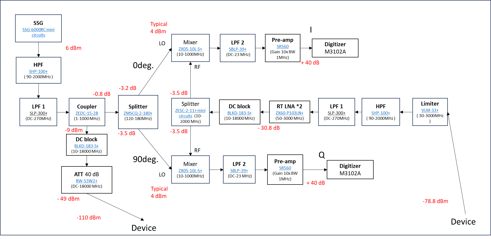

## 回路メモ（整理版）

### カプラーZEDC-15-2B
- 広帯域対応 (Wideband):
対応周波数が 1 MHz ～ 1000 MHz (1 GHz) と非常に広く、VHF/UHF帯や携帯通信、各種計測用途を幅広くカバーしています。

- 結合度 15 dB (Coupling):
結合度は 15 dB (±0.5 dB) です。つまり、結合ポートからは入力信号から15dB分（電力比で約31.6分の1）減衰させた信号が取り出されます。

- 優れた方向性 (Excellent Directivity):
標準で 30 dB という高い方向性を持っています。これにより、出力側からの不要な反射波の影響を排除し、純粋な入力信号のみを正確にモニタリングできます。

- 低損失 (Excellent Mainline Loss):
メインラインの挿入損失が標準で 0.8 dB と非常に小さく設計されています。メインの信号系に与えるロス（劣化）を最小限に抑えることができます。

- 最大入力電力:
最大 3.0 W の入力電力まで耐えることができます。

- 構造:
入出力に SMAコネクタ を採用しており、堅牢なシールドケース（Rugged shielded case）に収められているため、外部ノイズの影響を受けにくく、実験環境でも扱いやすい構造です。インピーダンスは50Ωです。

### Ohmic contact とは

金属配線と半導体を接続したとき、電流と電圧がオーム則に従う接触を **Ohmic contact** と呼ぶ。  
単に金属と半導体を接続すると、一般には **Schottky 障壁** が生じやすいため、障壁を抑えて線形な I-V 特性を得ることが重要。

---

### IQ demodulation

- I/Q で復調することで、搬送波そのものを保存せずに信号情報を扱える
- 実効的にデータ量を小さくできる
- Local oscillator（LO）を使ってミキシングする

---

### Attenuator（減衰器）

- 20 dB の減衰は、パワー比で $1/100$
- 室温から低温ステージへ入る熱雑音を抑えるため、段階的に減衰を入れる設計が一般的
- 各ステージで「必要信号レベル」と「熱雑音抑制」のバランスを取る

---

### Bias tee

- DC バイアスと RF 信号を同じ配線に重畳するために使う
- AC と DC を分離して扱える
- 寄生容量 $C_p$ は小さいほど望ましい場合が多い（実デバイス容量との兼ね合いが必要）

---

### その他メモ

- コイルの $Q$ factor の見積もり
- バラクタ（可変容量素子）の使いどころ
- Mixer は必要駆動パワーに合わせる
- デバイス入力は Attenuator で微調整
- VNA（Vector Network Analyzer）で S パラメータを測定

---

## パラメトリックアンプ

パラメトリックアンプは、非線形リアクタンス（主に可変容量）を利用して、微弱信号を低雑音で増幅する方式。

### 基本原理

- バラクタなどの非線形容量を利用
- ポンプ波（高周波）からエネルギーを供給し、信号波へ変換
- 抵抗性素子中心の増幅器に比べ、低雑音化が期待できる

### 量子計測での利用

- 代表例: JPA（Josephson Parametric Amplifier）
- 極低温環境で動作し、量子ビット読み出しの高感度化に有効
- 広帯域化の方向として JTWPA（進行波型）も重要

### 関連比較

- HEMT アンプ: 4 K 近傍で広く使われる低雑音アンプ
- パラメトリックアンプ: さらに低雑音が必要な場面で有利

参考:

- https://repository.dl.itc.u-tokyo.ac.jp/record/23490/files/sk011004001.pdf
- https://xtech.nikkei.com/atcl/nxt/column/18/02308/122800004/
- https://www.riken.jp/press/2025/20251030_1/index.html

---

## ベルとデシベル（整理）

### ベル（B）

基準量 $A_0$ に対する量 $A$ の比を、常用対数で表したものがベル（Bel）。

$$
\frac{L_A}{\mathrm{B}} = \log_{10}\left(\frac{A}{A_0}\right),
\qquad
\frac{A}{A_0} = 10^{L_A/\mathrm{B}}
$$

例：$A/A_0=1000$ なら

$$
\log_{10}(1000)=3 \Rightarrow L_A=3\,\mathrm{B}
$$

対数化の利点は、**比の掛け算を足し算で扱える**こと。

---

### デシベル（dB）

ベルは実務では刻みが粗いため、通常は $1/10$ 倍単位のデシベル（dB）を使う。

$$
L_{\mathrm{dB}} = 10\log_{10}\left(\frac{A}{A_0}\right)
$$

目安：

- $0\,\mathrm{dB}$：1倍
- $10\,\mathrm{dB}$：10倍
- $20\,\mathrm{dB}$：100倍
- $1\,\mathrm{dB}$：約1.259倍（工率比）

---

### 電力利得と電圧利得

電力比（工率比）をデシベルで書くと：

$$
L_P = 10\log_{10}\left(\frac{P_{\mathrm{out}}}{P_{\mathrm{in}}}\right)\,\mathrm{dB}
$$

電圧比（同一インピーダンス条件）では：

$$
L_V = 20\log_{10}\left(\frac{V_{\mathrm{out}}}{V_{\mathrm{in}}}\right)\,\mathrm{dB}
$$

これは、

$$
P \propto V^2
$$

から導かれる式変形の結果。

---

### よく使う近似

| dB | 場の量（電圧など） | 工率の量（電力など） |
|---:|---:|---:|
| 3 dB | 約1.41倍 | 約2倍 |
| 6 dB | 約2倍 | 約4倍 |
| 10 dB | 約3.16倍 | 10倍 |
| 20 dB | 10倍 | 100倍 |

※「何の比か（電圧か電力か）」で読み方が変わる点に注意。

---

## dBm

**dBm** は、1 mW を基準にした電力の対数表現。

- 1 nW = -60 dBm
- 1 μW = -30 dBm
- 1 mW = 0 dBm
- 1 W = 30 dBm
- 1 kW = 60 dBm

1 W 基準の dBW とは、

$$
\mathrm{dBW} = \mathrm{dBm} - 30
$$

の関係にある。

### 単位換算

電力 $P$（mW）と電力レベル $x$（dBm）の関係:

$$
x = 10\log_{10}\left(\frac{P}{1\,\mathrm{mW}}\right)
$$

電力を W で書くと:

$$
x = 30 + 10\log_{10}\left(\frac{P}{1\,\mathrm{W}}\right)
$$

逆変換:

$$
P(\mathrm{mW}) = 10^{x/10},\qquad
P(\mathrm{W}) = 10^{(x-30)/10}
$$

補足:

- +10 dB → 電力 10 倍
- +3 dB → 電力ほぼ 2 倍
- -3 dB → 電力ほぼ 1/2

詳細: https://ja.wikipedia.org/wiki/仕事率の比較

### dBとdBmの計算

---

## カプラー

カプラーは、主に高周波回路やマイクロ波の分野において、「主線路を流れる信号の電力を、一定の割合で分岐（サンプリング）して取り出す」ために使用される受動部品です。

一般的にカプラーには以下のポート（端子）があります。

- **入力ポート (Input)**: 信号が入ってくるポート
- **出力ポート (Output)**: 入力信号が主線路を通って出ていくポート（メインライン）
- **結合ポート (Coupled)**: 入力信号の一部を分岐して取り出すポート（モニタや測定器接続用）

### カプラーの重要な特性

- **結合度 (Coupling)**: 入力信号に対して、結合ポート信号がどれだけ減衰しているか（dB）
- **方向性 (Directivity)**: 進行波と反射波をどれだけ分離できるか。高いほど測定精度が高い
- **挿入損失 (Mainline Loss)**: カプラー挿入に伴う主線路側の電力ロス

---
