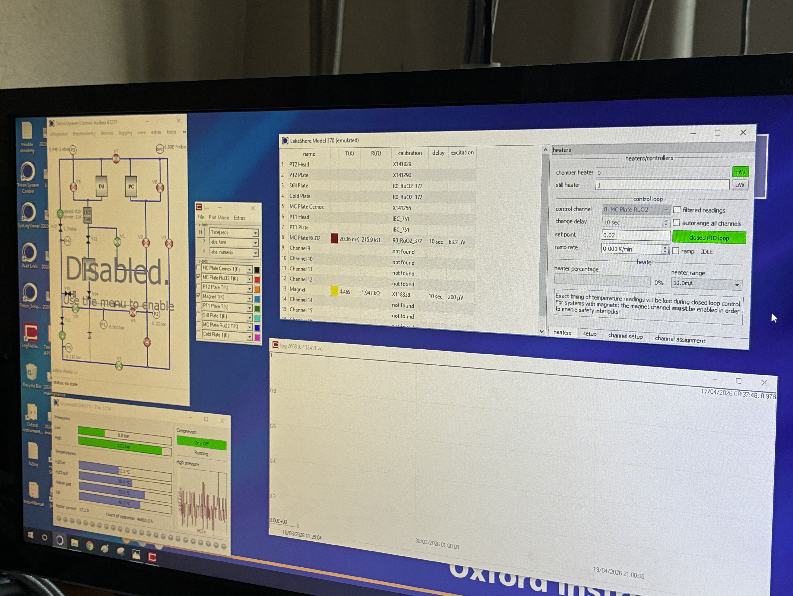

# Triton

### 実験室に来た時にやること
液晶を見る。
P2,P5の圧力が0.5 barを超えていないかCheck。
MC plateの温度が20mKほどかCheck。
Magnetの温度が4.4KほどかCheck。5Kを超えていたら報告。
Beep音が鳴ったら逃げる。

↓参照用。

noise

initialization to turn on ssg to check noise file to digitizer setting to measure to barlett and plot
data1 = I , data2 = Q

RF reflectmetry

readout setting to initialization to RF file(SSGはいらない) amplitude / phase to I/Q

セットアップを変える前はinitializationで電圧を0にする